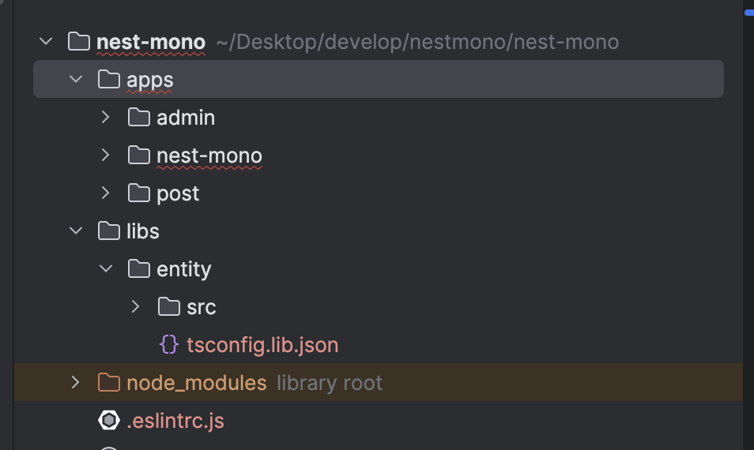

# Nest.js CLI를 활용한 모노레포 구성하기

대규모 애플리케이션 개발에 있어서 코드의 재사용성과 관리는 매우 중요합니다. <br />
이러한 문제를 해결하는 하나의 방법으로 모노레포(Monorepo) 구조를 사용할 수 있습니다.

모노레포는 여러 프로젝트의 코드를 한 개의 저장소에서 관리할 수 있게 해주어, 효율적인 코드 관리와 협업을 가능하게 합니다 이 글에서는 Nest.js CLI를 활용하여 모노레포 구조를 설정하는 방법에 대해 설명합니다.

## Nest.js CLI 설치

Nest.js CLI는 프로젝트를 생성하고, 모노레포 구조를 손쉽게 구성할 수 있는 명령어를 제공합니다.

모노레포 구성을 시작하기 전에, Nest.js CLI가 설치되어 있어야 합니다.<br />
CLI 설치는 다음과 같은 명령어로 수행할 수 있습니다

```bash title="Nest.js CLI 설치"
npm install -g @nestjs/cli

# 또는 yarn을 사용하는 경우
yarn global add @nestjs/cli
```

---

## Nest.js CLI를 사용한 워크스페이스 생성

먼저, 새로운 Nest.js 워크스페이스를 생성합니다.<br />

> **워크스페이스(work-space)**: nest에서 모노레포를 구성하는 데 사용될 최상위 폴더입니다.

```bash
nest new nest-mono
```

위 코드에서 `nest-mono`는 워크스페이스의 이름입니다.

워크스페이스를 생성했으니, 이제 사용할 애플리케이션과 라이브러리를 추가할 수 있습니다.

```bash
> cd nest-mono

# 애플리케이션 추가
> nest g app admin
> nest g app post

# 라이브러리 추가
> nest g lib entity
```

위 코드에서 `admin`, `post`, `entity`는 각각 추가하려는 애플리케이션과 라이브러리의 이름입니다.

위의 명령어를 통해서 워크스페이스 내부에 apps와 libs 폴더가 생성되며, 각각의 애플리케이션과 라이브러리가 추가됩니다.

- **apps**: 별도로 배포가 가능한 애플리케이션을 저장하는 폴더 <br />
- **libs**: apps에서 공유하는 라이브러리를 저장하는 폴더, apps에서 libs의 모듈을 의존성 주입받아 사용할 수 있습니다.

워크스페이스의 구조는 다음과 같습니다



---

## 기존 생성한 프로젝트 제거

`nest g app app-name`, `nest g lib lib-name` 명령어를 통해 생성한 apps와 libs 폴더를 사용해서 모노레포 구조를 구성했으므로, 기존에 `nest new nest-mono`명령어를 사용해서 생성한 프로젝트를 제거합니다.

기존의 프로젝트를 제거한 후, **_nest-cli.json_** 파일을 열어서 `projects` 속성 안의 "nest-mono"를 제거합니다.

```json title="nest-cli.json에서 제거 할 부분"
"nest-mono": {
  "type": "application",
  "root": "apps/nest-mono",
  "entryFile": "main",
  "sourceRoot": "apps/nest-mono/src",
  "compilerOptions": {
    "tsConfigPath": "apps/nest-mono/tsconfig.app.json"
  }
},
```

## 프로젝트 빌드 및 실행

모노레포 구조에서는 각 애플리케이션과 라이브러리가 독립적으로 빌드 및 실행 될 수 있습니다.

프로젝트의 루트에서 다음 명령어를 사용하여 특정 애플리케이션을 빌드하거나, 실행할 수 있습니다.

```bash
> nest build admin

> nest start admin
```

또한, 모든 애플리케이션과 라이브러리를 한 번에 빌드하는 것도 가능합니다

```bash
nest build
```

## 결론

Nest.js CLI를 사용하여 모노레포 구조를 구성하는 방법에 대해 알아보았습니다. <br />

기본 모놀리스 구조를 사용하면, 초기 개발 단계에서는 개발의 속도의 측면에서는 비즈니스 검증 및 빠른 개발이 가능하지만, 프로젝트 규모가 확장이 될수록 많은 개발자들이 동시에 작업을 진행할 때 코드의 충돌이 발생하거나 코드의 재사용성이 떨어질 수 있습니다.

모노레포 구조를 사용하면 여러 프로젝트의 코드를 한 개의 저장소에서 관리할 수 있어, 효율적인 코드 관리와 협업을 가능하게 합니다.
또한, 각 애플리케이션과 라이브러리가 독립적으로 빌드 및 실행될 수 있어, 개발 및 테스트가 용이하며,
각각의 애플리케이션과 라이브러리가 독립적으로 배포될 수 있어, 유연한 배포가 가능합니다.

다음 글에서는 TypeORM을 사용하여 애플리케이션과 라이브러리 간의 데이터베이스 연결을 설정하는 방법에 대해 알아보겠습니다.
