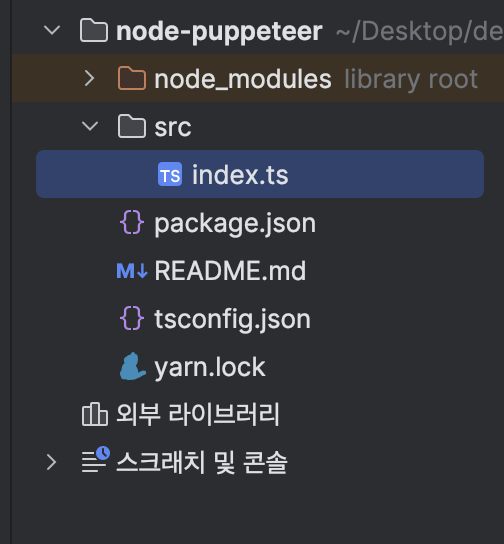

# 크롤러 사용하기 - 1. puppeteer 세팅

## puppeteer란?

**puppeteer**는 headless 브라우저를 제어할 수 있는 Node.js 라이브러리입니다. <br />

> **headless 브라우저**란? <br />
> 사용자 인터페이스가 없는 브라우저를 의미하며, 사용자 인터페이스가 없기 때문에 브라우저를 백그라운드에서 실행할 수 있습니다. <br />
> 즉, 브라우저에서 GUI가 없이 동작하게 되는 것입니다.

그래서 puppeteer를 사용하면 어떤 일을 할 수 있을까요?

### puppeteer 사용 예시

- 웹 페이지 스크린샷 찍기

  - 웹 페이지의 스크린샷을 찍어서 이미지 파일로 저장할 수 있습니다.

- 웹 페이지의 데이터 수집
- 웹 페이지의 데이터를 수집하고, 크롤링할 수 있습니다.

- 웹 페이지 사용자 시뮬레이션, 테스트 자동화
  - 어떤 웹페이지에서 유저가 회원가입을 하고, 로그인을 하거나 결제를 하는 등의 과정을 테스트하고 자동화 할 수 있습니다.
  - 보통 이런 작업의 경우는 Cypress와 같은 테스트 자동화 라이브러리를 사용하게 됩니다.

## puppeteer 설치하기

puppeteer를 설치할 디렉토리를 생성하고, 해당 디렉토리로 이동합니다.

```bash title="puppeteer 설치 디렉토리 생성"
mkdir puppeteer-crawler
cd puppeteer-crawler
```

이번 프로젝트는 typescript로 진행할 것이기 때문에 puppeteer와 typescript를 같이 설치하겠습니다.

```bash title="puppeteer, typescript 설치"
yarn add puppeteer
yarn add -D typescript tsconfig-paths
yarn add -D @types/puppeteer
```

프로젝트를 실행하기 위한 ts-node 설치

```bash title="ts-node 설치"
yarn add ts-node
```

## tsconfig.json 설정하기

```bash title="tsconfig.json 설정"
yarn tsc init
```

위 명령어를 실행하면 폴더내에 `tsconfig.json`파일이 생성됩니다. 해당 파일을 열어서 아래와 같이 설정합니다.

```json title="tsconfig.json"
{
  "compilerOptions": {
   ...기존 설정들
  },
  "include": [
    "/**/*.ts",
    "node_modules/@types/puppeteer/index.d.ts",
  ],
  "exclude": [
    "node_modules"
  ]
}
```

**include**는 `tsconfig.json` 파일이 있는 디렉토리 내의 모든 ts파일을 컴파일하도록 설정합니다. <br />
**exclude**는 `node_modules` 디렉토리 내의 파일은 컴파일하지 않도록 설정합니다.

ts 파일을 `ts-node`를 사용해서 실행해야 하기 때문에, `package.json` 파일을 열어서 아래와 같은 옵션을 추가합니다.

```json title="package.json"
{
  "scripts": {
    "start": "ts-node -r tsconfig-paths/register src/index.ts"
  }
}
```

이제 **puppeteer**를 사용할 준비가 되었습니다. `yarn start` 명령어를 통해 프로젝트를 실행할 수 있습니다.

## puppeteer 실행 코드 작성해보기



위 이미지의 구조처럼, 현재 디렉토리에 `src` 디렉토리를 생성하고, `index.ts` 파일을 생성합니다.

```typescript title="src/index.ts"
import * as puppeteer from 'puppeteer';

const initBrowser = async () => {
  const browser = await puppeteer.launch({
    headless: false,
    slowMo: 50,
    // defaultViewport: null,
    // args: ['--start-maximized']
  });

  return browser;
};

(async () => {
  const browser = await initBrowser();
  const page = await browser.newPage();

  await browser.close();
})();
```

위 코드는 puppeteer를 사용해서 브라우저를 실행하고, 새로운 페이지를 생성한 뒤, 브라우저를 종료하는 코드입니다.

- `headless` 옵션은 브라우저를 실행할 때, GUI를 띄울지 여부를 결정하는 옵션입니다. <br />
- `slowMo` 옵션은 브라우저의 동작을 느리게 하는 옵션입니다. <br />
- `defaultViewport` 옵션은 브라우저의 크기를 지정하는 옵션입니다. <br />
- `args` 옵션은 브라우저를 실행할 때, 추가적인 옵션을 설정할 수 있습니다.

이제 `yarn start` 명령어를 통해 프로젝트를 실행하면, 브라우저가 실행되고, 깜빡하는 순간에 종료됩니다.

`browser.close()` 코드를 주석처리하고 실행하면, 브라우저가 실행되고 종료되지 않고 계속 실행되는 것을 확인할 수 있습니다.

이렇게 puppeteer를 사용해서 브라우저를 실행하고, 페이지를 생성하는 프로젝트를 생성 및 실행해보았습니다.
